# Review: composability of src/web

Lens: software engineering. Each component should do one thing. Pages should be aggregations of components. Components should be reused across pages and within a page.

## Scope

- `src/web/**`, including `src/web/ui/**` (46 component files plus CSS) and `src/web/forms/**`.
- About 11.6k lines in total.
- `doc/web_components.md` was context only. No `doc/review_*.md` was read.
- No `src/` file was edited.

## Method

Verified by running:
- `cargo check --features web --offline` succeeds with no warnings.
- A throwaway Python script in the scratchpad parsed `use super::`, `use crate::web::` and `super::{..}` lines.
  - It built the module-level graph and fan-in tables.
  - It computed strongly connected components (cycles).
  - Output was spot-checked with grep.
- A second script counted component invocations (`name(` in non-test code, excluding the definition) for every `#[component]` in `ui/*.rs`. Counts below come from it.
- All CSS files in `ui/` were checked against the bundle list in `ui/mod.rs:61-108`. Every sheet is bundled.

Inferred (read, not run):
- Cohesion judgements ("god", "thin wrapper").
- Which duplicates are real.
- The proposed fixes. None were compiled.

Not checked:
- Runtime behaviour. No server was started and no page was rendered.
- `board.js` and `org.js`.
- Dependencies that cross the `src/web` boundary (`db`, `models`, `reporting`) except where noted.
- Items used only through macro-generated code. For example, `#[component]` and `view!` could hide a call the regex missed.
- Fully qualified paths with no `use` (regex covers `super::` / `crate::web::` only).
- Test modules were excluded from call counts. Some "unused" items could be used in tests.

## Dependency graph

Module-level graph. Edges are `use` and call sites. `ui::*` leaves are summarised by fan-in. Cycles are drawn as dashed red edges.

```mermaid
flowchart TD
  subgraph ROUTE[routes / pages]
    home; boards; org; project; task; board_info; settings; folders
    agenda; matrix; org_edit; project_edit; task_edit; board_edit
    project_new; task_new; agenda_drop
  end
  subgraph PAGEPARTS[page-level helpers]
    board_header; board_page; board_cards; agenda_cards; agenda_day; agenda_pick; pick
    quadrants; project_rows; task_rows; task_panel; settings_panel; session_lines
    org_report; project_options; settings_fields; task_fields; sections; crumbs
    edit_page; footer; layout
  end
  subgraph LOGIC[logic / state]
    edit[edit.rs EditForm]; forms[forms/*]; task_query; url; load; drop; folder_picker
  end
  subgraph UI[ui components]
    frame; page_header; breadcrumb; tabs; columns; group_card; project_list
    task_card; task_table; tasks_tab; filter_bar; panel; field; group; notice; form_error
    form; form_actions; modal; status; tag_chips; ink; icons; count; empty_line
    quadrant; unplaced_list; drop_zone; side_rail; side_lists; pick_bar; pick_here; button
  end
  home & boards & org & project & task & settings & board_info & folders --> frame
  home & boards & org & project & task & settings & folders --> page_header
  org & project --> tasks_tab --> task_table & filter_bar
  org & project --> tabs
  org --> org_report --> sessions_table
  org & project --> task_rows --> task_table
  org & project --> settings_panel --> panel
  task --> task_panel --> panel
  agenda & matrix --> board_page --> board_cards --> task_card
  agenda & matrix --> board_header --> tabs & breadcrumb & page_header
  agenda --> agenda_cards --> task_card & unplaced_list & side_rail
  matrix --> quadrants
  matrix --> quadrant --> task_card & drop_zone & count
  org_edit & project_edit & task_edit & board_edit --> edit_page --> frame & field & form & form_actions & notice
  org_edit & project_edit & task_edit & board_edit --> edit --> forms
  forms -. "cycle: forms/*.rs use web::edit::EditForm" .-> edit
  edit -. "NAME const" .-> forms
  field -. "cycle" .-> group
  group -.-> field
  field -.-> notice
  notice -.-> field
  field --> form_error
  settings & project_new & task_new --> form & form_actions & notice
  project_new & task_new --> modal
  org -. "cycle: page SCC" .-> project_new
  project_new -.-> org
  project_new -.-> board_info
  board_info -.-> project_new
  project -.-> task_new
  task_new -.-> project
  task_new -.-> org
  org -.-> task_new
  folders -.-> project_new
  project_new -.-> folders
  url -.-> task_query
  forms --> url
  task_card --> status
  panel --> tag_chips --> ink
  project_new --> folder_picker
  layout --> footer --> site_footer
  linkStyle default stroke:#888
```

Cycles found by SCC (verified by the script):
1. `forms` and `edit`:
   - `forms/{board,org,project,task}.rs` use `crate::web::edit::{EditForm, name_field}` (e.g. `forms/task.rs:6`).
   - `edit.rs:6` uses `forms::NAME`.
2. `ui::field`, `ui::group`, `ui::notice`:
   - `field.rs:10-11` uses `group` and `notice::ERROR_ID`.
   - `group.rs:5` uses `field::{hint_id, invalid_cue}`.
   - `notice.rs:3` uses `field::field_id`.
3. `{org, project, task_new, project_new, board_info, folders}`:
   - Pages import each other's `screen` and `load`.
   - `project_new.rs:13,16,18` use `board_info`, `folders`, `org`.
   - `task_new.rs:12-13` use `org`, `project`.
   - `org.rs:10,14`, `project.rs:12`, `board_info.rs:9` and `folders.rs:8` use the creators.

`url` and `task_query` have a one-way dependency, `url.rs:4` to `task_query::DEFAULT`. `url` is the most depended-on module (31 dependents).

## Findings

Severity: H = structural, M = notable, L = tidy.

### H1. Page-level cycle: "new X" modules and the pages they overlay depend on each other (cycle 3)
- Where:
  - `project_new.rs:13,18`, `task_new.rs:12-13`.
  - `org.rs:10,14`, `project.rs:12`, `board_info.rs:9`, `folders.rs:8`.
- Why: the creation flow is "render the page under it with the modal on top". To do that it imports each host page's private `screen`/`load`, and the hosts import `project_modal`, `task_modal` and `Home`/`TaskHome`.
  - Six modules cannot be understood or tested independently.
  - A host page also has to know about modal state (`TabQuery.new/name/base_path`, `sections.rs:14-33`).
- Fix:
  - Move the shared, data-only items (`Home`, `TaskHome`, `ProjectCreate`, `TaskCreate` and their URL helpers) into one module, e.g. `create.rs`.
  - Make `project_modal` and `task_modal` pure components with no page imports.
  - Have `project_new`/`task_new` accept a `host: impl Fn(Modal) -> View` or a small `Host` trait from each page, so the dependency points one way (new -> host, via a trait).

### H2. `project_new.rs` (411 lines) is a god module
- Evidence: `project_new.rs:48-300`. One file holds:
  - the `Home` enum with 8 URL builders and DB creation (`create`, `template`, `exists`, 117-150);
  - the modal component (170);
  - two quick-create routes (259-266);
  - the folder-picker route (286);
  - the page it re-renders (`list_page`, 239);
  - the settings-form glue (347).
  - It imports 14 sibling modules, the most of any module, and mixes routing, URL building, persistence and view.
- Fix: split into `project_create` (model/Home/URLs), `project_modal` (component) and routes. Move `pick_folder` next to `folder_picker.rs`/`folders.rs`.
- `task_new.rs` (326 lines) has the same shape on a smaller scale: `TaskHome`, `TaskCreate`, `task_modal`, `save`, `old_form`.

### H3. `url.rs` is a god utility (236 lines, fan-in 31)
- `url.rs:4` pulls `task_query::DEFAULT`, so the URL layer depends on query-language policy.
- Every page and the `forms/*` model layer depend on it.
- Fix:
  - Split by entity: `url/{org,project,task,board}.rs`. Re-export in `url/mod.rs` if the churn is unwanted.
  - Pass the default query in as a parameter instead of importing `task_query::DEFAULT`, which removes the edge.

### H4. `forms/*` (model-to-form mapping) depends on the HTTP layer; `edit` depends back on `forms` (cycle 1)
- `forms/task.rs:6-7` imports `web::edit::{EditForm, name_field}` and `web::url::task_url`.
  - The same pattern is in `forms/{board,org,project}.rs`, so parsing a form needs the router.
  - `forms/mod.rs` also hosts `SettingsForm`, which is shared by three pages.
- `edit.rs:6,56` needs `forms::NAME` only for `name_field`.
- Fix:
  - Move `NAME` and `DESCRIPTION` to `edit.rs` (or a `names.rs`). `edit_page.rs:11` already uses both from `forms`.
  - Let `EditForm` return a `saved_path(id)` through a small `Routes` trait or a plain `fn` stored in the form. Then `forms` need not import `url`.
  - Or fold `forms/` into `edit/` (`edit/{mod,org,project,task,board}.rs`) so the cycle becomes internal.

### M1. `ui::field` / `group` / `notice` cycle (cycle 2)
- `field.rs` (300 lines) is a bundle, not a single feature. It holds:
  - the field-id and described-by helpers;
  - `field`, `textarea`, `checkbox`, `checklist`, `select`;
  - the `CheckOption` helpers (`optional_options`, `id_text`).
- `group` (a fieldset) uses `invalid_cue`/`hint_id`. `notice::error_box` uses `field_id`. `field` uses `notice::ERROR_ID` and `group`.
- Fix:
  - Create `ui/field_ids.rs` holding `field_id`, `hint_id`, `ERROR_ID` and `invalid_cue`. All three modules depend on it and the cycle disappears.
  - Optionally split `field.rs` into `text_field.rs` (field, textarea), `choice.rs` (checkbox, checklist, select) and `options.rs`.

### M2. Form page skeleton repeated four times (redundancy)
- The same sequence appears in `edit_page.rs:75-94`, `settings.rs`, `project_new.rs` and `task_new.rs`:
  `form(action, error_box, required_note, <fields>, form_actions(cancel, submit_label))`.
- `edit_page` is a page-level helper that wraps it and also adds `frame`, a header, and Name/Description.
- Fix:
  - Introduce one `ui::form_shell(action, error, cancel, submit_label, child)` that bundles `form`, `error_box`, `required_note` and `form_actions`. Use it in all four.
  - Alternatively, absorb `required_note`, `error_box` and `form_actions` into `ui::form` as slots.
  - `ui::form_actions`, `ui::form` (with `required_note`) and `notice::error_box` are always used together (each has exactly 4 call sites in the same four files), so they are not independently reusable.

### M3. `pick.rs` / `agenda_pick.rs` / `board_page.rs` / `board_cards.rs` / `agenda_cards.rs` / `agenda_day.rs` / `quadrants.rs`: many tiny coupled modules
- This is a 7-module cluster where only `agenda` and `matrix` are consumers.
- `agenda_pick.rs` extends `pick::Picked` with an inherent `impl`, with page-specific methods in another file. Matrix does the same inside `matrix.rs`. This splits one type over three files.
- `Picked` is also a different type in `folder_picker.rs:12`. The same name means two things in the web crate.
- Fix:
  - Rename `folder_picker::Picked` to `PickResult`.
  - Fold `agenda_pick` into `pick/agenda.rs` and the matrix words into `pick/matrix.rs`.
  - Consider folding `board_cards.rs` and `board_page.rs` (both about "load a board's cards") into one `board/` directory.

### M4. `agenda.rs` and `matrix.rs` duplicate page scaffolding
- Both start with the same imports (`board_header`, `board_page`, `pick_bar`, `pick_here`, `sticky_head`, `jump_link`, `info_columns`, `board_root`, `post_button`, `frame`). Compare `agenda.rs` and `matrix.rs` use lists.
- Both build the same pick banner plus a "not placed / unplaced" side list.
- Fix: extract `board_screen(frame, header, pick_banner, main, side)` taking the page-specific main and side content. Both pages then become data plus two closures.

### M5. Dead or unused component
- `ui/button.rs:22` `add_button` has zero call sites (script count 0; `grep` finds only the definition).
  - The same "+ label" link is hand-written in `ui/task_table.rs:60-63` and `ui/project_list.rs:41-42`, using the `add-link` class and `PLUS` instead of the component.
  - `doc/web_components.md:168` claims `tasks_tab` uses it, which is stale.
- The compiler does not warn, because the item is `pub` in a private module and the component macro seems to expose it (inferred).
- Fix: have `task_table` and `project_list` call `add_button` (or a `add_link` row variant), or delete `add_button`.

### M6. Single-use components that are really page fragments
Components with one call site, in `ui/`:

| Component | Used by |
|---|---|
| `day_nav`, `hour_grid` + `hour_slot` | `agenda.rs` only |
| `matrix_grid`, `quadrant` | `matrix.rs` only |
| `folder_list` | `folders.rs` only |
| `folded_list` | `agenda_cards.rs` only |
| `site_footer` | `footer.rs` only |
| `task_table` | `tasks_tab` only |
| `tag_chips` | `ui::panel` only |
| `breadcrumb` | `ui::page_header` only (`Crumb` is re-exported and used by pages) |
| `info_body` | `board_info.rs` only |
| `invalid_cue` | `ui::group` only |
| `mono_value` | `project.rs` only |
| `checklist` | `project_options.rs` only |
| `flag_row` | `settings_panel.rs` only (3 uses) |
| `value_row`, `chips_row` | `task_panel.rs` only |

- Several are legitimately page-scoped (the grid, the day view). Others are wrappers, e.g. `matrix_grid` is `
(child)
` and `side_lists` is a bare `<aside>`.
- Fix:
  - Keep one-use components that hold real logic (`hour_grid`, `quadrant`, `task_table`).
  - Inline the trivial wrappers (`matrix_grid`, `info_body`), or put them in `ui/layout.rs` as a "layout atoms" file (columns, matrix_grid, side_lists, sticky_head, jump_link). That would remove about 6 files. They are 11-24 line modules with a CSS file each.

### M7. Near-duplicate pairs (could be one parametrised component)
- `task_panel.rs` and `settings_panel.rs` (33 and 28 lines) are thin mappers onto `ui::panel`. They are fine, but `panel` has 5 row builders (`text_row`, `value_row`, `chips_row`, `flag_row`) each used by one caller.
  - Collapse into a `Row` enum (Text/Value/Chips/Flag) so the panel takes `rows: &[Row]`. This removes 4 public components.
- `ui::empty_line` (10 uses), `ui::empty_state`, `ui::board_empty` are three layers of "nothing here".
  - `board_empty` (15 lines) only wraps `empty_state` with a fixed icon and is used twice.
  - `empty_state` is used by `home`/`boards` only.
  - Fold `board_empty` into a call to `empty_state(svg: KANBAN)` at the two sites.
- `ui::labelled::labelled_section` and `ui::columns::info_columns` are both "headed section" containers (3 and 5 uses). Likely mergeable (inferred, not compared line by line).
- `crumbs.rs` (page crumb data) and `sections.rs` (tabs and the `TabQuery` struct) are each a mapper for `ui::breadcrumb`/`ui::tabs`.
  - `sections.rs` also owns `TabQuery`/`InfoQuery`, which hold the modal state (`new`, `name`, `base_path`). It is a query-parsing module with a misleading name; rename to `query.rs`.

### M8. `project_options.rs` depends on a UI card constant
- `project_options.rs:9` imports `ui::group_card::NO_PROJECTS`. The form-support module reaches into a presentation component for text.
- Fix: move the constant to a shared `text.rs`, or have the caller pass the empty-text.

### L1. `ui::*` imports icons both through `super::{ICON, icon}` and the `ui::` re-export; `Crumb` has two paths
- Both `ui::Crumb` (`ui/mod.rs:194`) and `ui::breadcrumb::Crumb` are used (`edit_page.rs:12`, `org_report.rs:12` uses `ui::{...}`).
- Fix: pick one path.

### L2. `task_rows::chips` / `issue_label` is used from `task_panel` while `task_rows` also depends on `task_query`
- `task_panel` -> `task_rows` -> `task_query` pulls the query parser into the details panel. The coupling is through `chips`, which has nothing to do with the query.
- Fix: move `chips` and `issue_label` into `task_fields`/a `task_text.rs` module.

### L3. Mixed file naming for "one thing in two places"
- `layout.rs` + `footer.rs` + `ui/site_footer.rs`: three files for the page footer.
- `settings.rs` + `settings_fields.rs` + `settings_panel.rs`: the same.
- `task.rs` + `task_edit.rs` + `task_fields.rs` + `task_new.rs` + `task_panel.rs` + `task_query.rs` + `task_rows.rs`: seven top-level files with a shared `task_` prefix.
- Fix: turn the `task_*`, `project_*`, `org_*` and `board_*` families into subdirectories (`task/{mod,edit,new,fields,panel,query,rows}.rs`). That makes the page-to-part edges visible in the tree and keeps `mod.rs` (`web/mod.rs:10-61`) short (about 55 `mod` lines today).

### What is good (so it is not lost)
- `ui/` never imports page code. Its only outside edge is `assets` (`ui/mod.rs:63`), so the layering is real.
- Components are invoked from many pages:
  - `frame`: 11 uses.
  - `field`: 16 uses.
  - `empty_line`: 10 uses.
  - `page_header`: 9 uses.
  - `task_card`: 7 uses.
  - `info_columns`: 5 uses.
- Each component is paired with its own CSS file, and all are bundled.

## Concrete simplification plan (ordered by value / cost)

1. Extract `ui/field_ids.rs` (M1). Cost: small. Removes cycle 2.
2. Move `NAME`/`DESCRIPTION` to `edit.rs` and make `EditForm::saved` independent of `url` (H4). Cost: small. Removes cycle 1.
3. Create `create.rs` for `Home`/`TaskHome`/`ProjectCreate`/`TaskCreate` and turn the modal components into pure views (H1). Cost: medium. Breaks the 6-module cycle and shrinks `project_new.rs`.
4. Add `ui::form_shell` (M2). Cost: small. Removes about 4x4 duplicated lines.
5. Delete or adopt `add_button` (M5). Cost: trivial.
6. Merge layout atoms (`columns`, `matrix_grid`, `side_lists`, `sticky_head`, `jump_link`) into one file (M6), and `panel` row builders into a `Row` enum (M7).
7. Extract the shared agenda/matrix screen scaffold (M4).
8. Split `url.rs` per entity and drop the `task_query` import (H3).

## Confidence

- High: the cycles, fan-in and call-site counts. They are mechanical, taken from `use` lines plus a `name(` scan, and the code compiles.
- Medium: "god module", "thin wrapper" and "duplicate" judgements. They come from reading headers and function lists, not whole files. I read in full only `edit.rs`, `edit_page.rs`, `sections.rs` (head), and parts of the others.
- Medium-low: the claim that `labelled_section` and `info_columns` can be merged, and that the compiler's dead-code lint stays silent because of the component macro.
- The Mermaid graph is summarised. It shows module edges, not every item-level edge (traits other than `EditForm`, structs and constants).

## What I could not assess

- Runtime behaviour, or whether any proposed merge changes rendered HTML. CSS selectors may depend on wrapper elements.
- The JavaScript files (`board.js`, `org.js`) and their coupling to class names and IDs.
- Item-level dependencies below module level (which struct is used where) beyond what is listed.
- Whether the topcoat `#[component]`/`view!` macros impose a constraint that forces the small-file layout (e.g. the `recursion_limit` note at `src/main.rs:1-4`).
- Test coverage of the pieces proposed for movement. Tests exist inline (`#[cfg(test)]`) in many of these files and would need to move with them.
